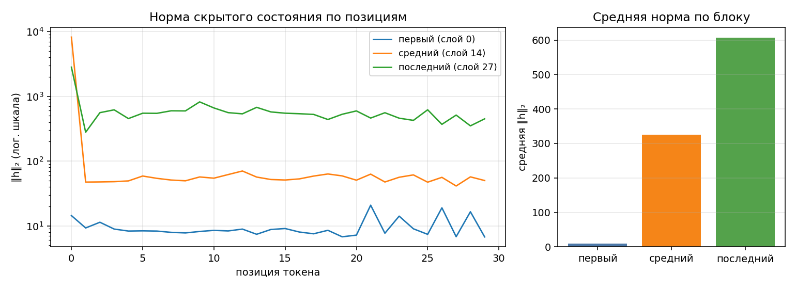

# Анатомия Qwen3-0.6B

Дата разбора (UTC): 2026-09-15T14:59:49.503031+00:00. Источник чисел: `report.json`.

## 1. Конфигурация и параметры

| Параметр | Значение |
|---|---:|
| num_hidden_layers | 28 |
| hidden_size | 1024 |
| intermediate_size | 3072 |
| num_attention_heads | 16 |
| num_key_value_heads | 8 |
| head_dim | 128 |
| vocab_size | 151936 |
| tie_word_embeddings | True |

| Группа | Модулей | Shape | Уникальных параметров | Доля | Общих параметров |
|---|---:|---|---:|---:|---:|
| embed | 1 | 151936×1024 | 155 582 464 | 26.1023% | 0 |
| q_proj | 28 | 2048×1024 | 58 720 256 | 9.8516% | 0 |
| k_proj | 28 | 1024×1024 | 29 360 128 | 4.9258% | 0 |
| v_proj | 28 | 1024×1024 | 29 360 128 | 4.9258% | 0 |
| o_proj | 28 | 1024×2048 | 58 720 256 | 9.8516% | 0 |
| gate_proj | 28 | 3072×1024 | 88 080 384 | 14.7774% | 0 |
| up_proj | 28 | 3072×1024 | 88 080 384 | 14.7774% | 0 |
| down_proj | 28 | 1024×3072 | 88 080 384 | 14.7774% | 0 |
| norm | 113 | 128, 1024 | 65 536 | 0.0110% | 0 |
| lm_head | 1 | 151936×1024 | 0 | 0.0000% | 155 582 464 |
| Итого | | | 596 049 920 | 100% | |

Прямой подсчёт по model.parameters(): **596 049 920**. Разница с таблицей: **0**.
Все строки «имя параметра → shape → число → tied» сохранены в `report.json`.

Общие входные и выходные веса учитываются один раз. В строке lm_head
показан размер переиспользуемой матрицы, но он не прибавляется к итогу.
У SwiGLU три широкие проекции, поэтому суммарный MLP тяжелее attention.
GQA использует 16 Q-голов и 8 KV-голов: при одинаковых длине контекста и dtype размер KV-cache составляет 0.50 от MHA.

## 2. Условия замера

| Условие | Значение |
|---|---|
| платформа | macOS-26.5.2-arm64-arm-64bit |
| устройство | mps |
| dtype базовых весов | bfloat16 |
| seq_len × batch | 256 × 1 |
| прогонов на режим | 1, отдельный процесс на каждый прогон |
| память измерена | torch.mps.driver_allocated_memory |
| дополнительная RSS | ru_maxrss |
| Python | 3.12.14 |
| torch | 2.8.0 |
| transformers | 4.57.1 |
| peft | 0.17.1 |
| seed / learning rate | 42 / 1e-05 |
| use_cache | True |
| оптимизатор | AdamW, один шаг |

Вход — случайные token ID, одинаковые при одинаковом seed. Измеряется
инференс (один forward под inference_mode), full fine-tune и LoRA
(forward + backward + optimizer.step). Базовые веса перед каждым
режимом загружаются заново. Родитель освобождает свою модель перед замерами.
Общее время включает загрузку; отдельно сохранено время вычислительного шага.

На MPS память драйвера опрашивается каждые 10 мс, а также после загрузки,
forward, backward, шага оптимизатора и очистки градиентов. Это максимум
наблюдений: очень короткий пик между выборками может быть пропущен.
Метрика включает буферы Metal/MPSGraph и кеш аллокатора. На CUDA используется
max_memory_allocated со сбросом high-water mark; на CPU — пик RSS.
Все размеры обозначены в MiB (2²⁰ байт); исторические поля JSON *_mb имеют те же единицы.

## 3. Активации и хуки

Промпт: «Объясни, что такое MLOps, в трёх предложениях.». После chat template: 30 токенов.

| Блок | Индекс | Средняя L2-норма | Максимальная | Позиция максимума |
|---|---:|---:|---:|---:|
| первый | 0 | 9.674 | 20.844 | 21 |
| средний | 14 | 325.445 | 8189.664 | 0 |
| последний | 27 | 606.979 | 2815.101 | 0 |

Снята L2-норма скрытого вектора каждого токена на выходе декодер-блока.
Residual-связи позволяют накапливать изменения скрытых состояний; наблюдаемое
изменение норм не является оценкой качества модели. Отдельные высокие пики
показывают неоднородность активаций, но сами по себе не доказывают механизм attention sink.
Хуков до/после первого/после повторного прогона: **0 / 0 / 0**. Нормы двух прогонов совпадают: **True**.
Хуки удаляются в finally; исходные train/eval-флаги каждого модуля восстанавливаются.

## 4. Арифметика LoRA

Для Linear с формой веса (out, in): A имеет форму (r, in), B — (out, r).
Число новых параметров: **r × (in + out)** на каждый целевой модуль,
суммируем по всем слоям. Смещения отключены. Конфиг «все линейные»
означает семь типов проекций декодера из params.yaml, без общего lm_head.

| Конфиг | Формула | PEFT | Разность | Доля от базовой модели |
|---|---:|---:|---:|---:|
| r=8, q_proj+v_proj | 1 146 880 | 1 146 880 | 0 | 0.1924% |
| r=16, все линейные | 10 092 544 | 10 092 544 | 0 | 1.6932% |

Доля PEFT в stdout использует знаменатель «база + адаптер», поэтому
отличается от доли относительно только базовой модели в таблице.

## 5. Память в трёх режимах

| Режим | Пик, MiB | RSS, MiB | К инференсу | Всего, с | Шаг, с | PID |
|---|---:|---:|---:|---:|---:|---:|
| inference | 1546.8 | 478.1 | 1.00 | 2.318 | 0.256 | 16097 |
| full_ft | 7202.6 | 1111.7 | 4.66 | 3.492 | 1.758 | 16109 |
| lora | 3270.8 | 534.7 | 2.11 | 3.949 | 0.655 | 16120 |

Размеры реально существующих тензоров (градиенты — до zero_grad,
состояния оптимизатора — после первого optimizer.step):

| Режим | Веса, MiB | Градиенты, MiB | AdamW, MiB |
|---|---:|---:|---:|
| inference | 1136.875 | 0.000 | 0.000 |
| full_ft | 1136.875 | 1136.875 | 2273.751 |
| lora | 1141.250 | 4.375 | 8.750 |

Фактические dtype тензоров:

- inference: веса {'torch.bfloat16': 1192099840}; градиенты {}; AdamW {} (значения в байтах).
- full_ft: веса {'torch.bfloat16': 1192099840}; градиенты {'torch.bfloat16': 1192099840}; AdamW {'torch.float32': 1240, 'torch.bfloat16': 2384199680} (значения в байтах).
- lora: веса {'torch.bfloat16': 1192099840, 'torch.float32': 4587520}; градиенты {'torch.float32': 4587520}; AdamW {'torch.float32': 9175488} (значения в байтах).

Базовые веса занимают **1136.875 MiB**. Все три измеренных пика не меньше размера весов.
Полное обучение добавляет к инференсу **5655.8 MiB**, LoRA — **1724.0 MiB**.
При full fine-tune градиенты и два момента AdamW создаются для всех параметров.
В LoRA базовые веса заморожены, эти тензоры нужны только адаптерам. PEFT
по умолчанию повышает точность обучаемых адаптеров до float32; это учитывается
по фактическим element_size, а не предположением «везде 2 байта».
Разницу между пиком и суммой перечисленных тензоров нельзя целиком назвать
активациями: туда входят временные буферы, logits, KV-cache, кеш аллокатора
и служебные выделения. Компоненты также могут достигать максимумов в разное время.
Разброс пиков RSS между режимами: **633.6 MiB**. На Apple Silicon RSS не отражает весь объём буферов Metal.

Для сравнения: в лекции при seq_len=256, batch=1, MPS приведены пики
2222 / 7166 / 3606 MiB. Наши результаты относятся к приведённым выше версиям
библиотек и условиям, поэтому совпадение чисел с лекцией не ожидается.

## 6. Исправленные дефекты

### 1. Общие веса считались повторно

В заготовке каждая строка named_parameters(remove_duplicate=False) имела tied=False. Получалось 751 632 384 вместо 596 049 920: лишних 155 582 464 параметров.
Добавлен учёт id параметра. Повторная ссылка видна в таблице, но исключена
из суммы. После исправления таблица и прямой подсчёт совпадают точно.

### 2. Хуки оставались на модели

register_forward_hook вызывался без сохранения handle и последующего remove.
При трёх различных блоках каждый вызов добавлял три хука: после двух — шесть.
Контекстный менеджер теперь снимает свои хуки даже при исключении. В реальном разборе после двух вызовов осталось 0 хуков; повторные активации совпадают.

### 3. Измерялся остаток памяти вместо пика

PeakMemory читал память только в __exit__, после gc.collect. Промежуточные
максимумы терялись. Теперь на MPS идёт фоновый опрос и сохраняется максимум,
на CUDA используется high-water mark. Границы стадий записаны в JSON.
Регрессионный тест задаёт последовательность 100 → 900 → 50 байт:
сохранённый максимум равен 900, а не последнему значению 50.
Каждый режим и повтор перенесён в отдельный процесс, чтобы пики предыдущего
режима не влияли на последующие.

- inference: 170 выборок; пик 1546.8 MiB; последняя граница стадии 1546.8 MiB.
- full_ft: 237 выборок; пик 7202.6 MiB; последняя граница стадии 7202.6 MiB.
- lora: 304 выборок; пик 3270.8 MiB; последняя граница стадии 3270.8 MiB.

### 4. На ускорителе использовалась RSS

device_allocated_bytes и device_metric_source возвращали результат peak_rss
даже для MPS/CUDA, хотя подпись называла его памятью аллокатора.
Теперь реально вызывается `torch.mps.driver_allocated_memory`. Например, full fine-tune: **7202.6 MiB** по метрике устройства против **1111.7 MiB** RSS.
Разделены основной показатель, дополнительная RSS и название источника.

## 7. Проверка и сводная таблица

`make test` проверяет tied weights, очистку хуков и восстановление режима
при ошибке, источники памяти, сохранение промежуточного пика и отдельные процессы.
`make check` выполняет семь проверок задания, в том числе реальные прогоны модели.
Сводная таблица `anatomy-worksheet.xlsx` заполнена по данным этого отчёта.
При повторном make inspect JSON и Markdown обновляются; значения в Excel нужно
сверить заново, поскольку это отдельная сводная таблица.

Источники: задание ДЗ 2 и лекция 2 из выданного архива;
[память драйвера MPS](https://docs.pytorch.org/docs/main/generated/torch.mps.driver_allocated_memory.html);
[точность адаптеров PEFT](https://huggingface.co/docs/peft/developer_guides/troubleshooting).
